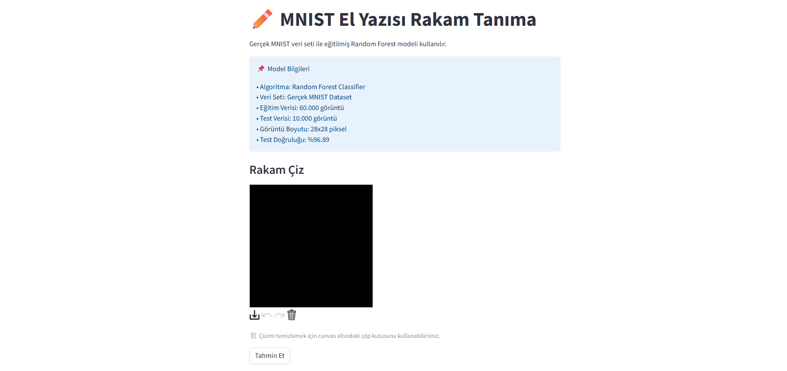
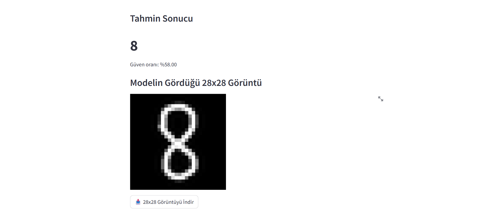
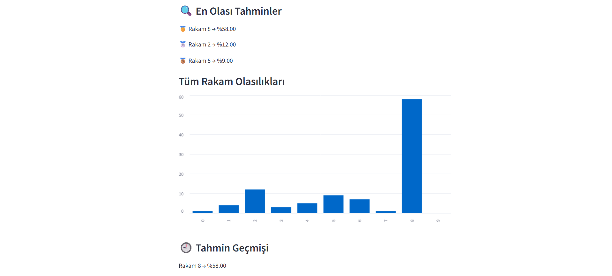
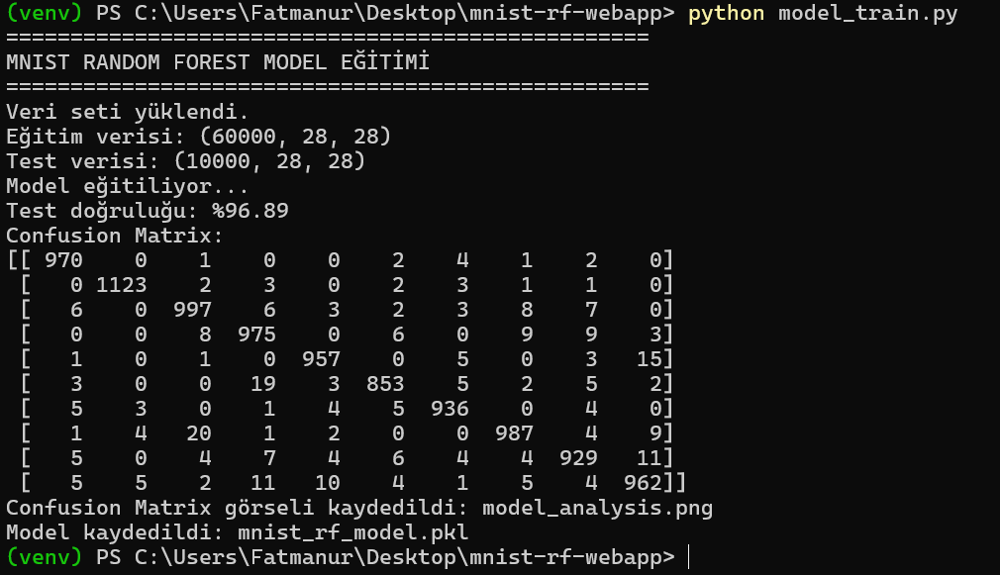
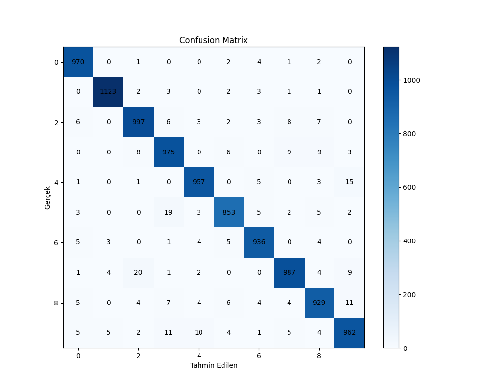

# ✏️ MNIST RF WebApp

Handwritten digit recognition web application built with **Random Forest** and the **MNIST dataset** using a **Streamlit** interface.

---

## 🚀 Project Overview

This project is a machine learning based web application that recognizes handwritten digits drawn by the user.

The model was trained using the real **MNIST handwritten digit dataset** and integrated into a web interface created with Streamlit.

Users can:

- Draw digits on a canvas
- Get instant predictions
- View prediction confidence scores
- See top predicted digits
- Analyze model probabilities visually

---

## 🧠 Technologies Used

- Python
- Streamlit
- Scikit-learn
- Random Forest Classifier
- TensorFlow / Keras
- NumPy
- Pillow
- Matplotlib

---

## 📊 Dataset

The project uses the real **MNIST dataset** loaded from:

```python
from tensorflow.keras.datasets import mnist
```

Dataset details:

- 60,000 training images
- 10,000 test images
- 28x28 grayscale handwritten digit images
- 10 classes (digits 0–9)

---

## 🎯 Model Information

| Feature | Value |
|---|---|
| Algorithm | Random Forest |
| Number of Trees | 100 |
| Max Depth | 25 |
| Test Accuracy | 96.89% |
| Input Size | 28x28 |

---

## 🖥️ Web Application Features

✅ Handwritten digit drawing canvas  
✅ Real-time prediction system  
✅ Confidence score display  
✅ Top 3 predictions  
✅ Probability visualization chart  
✅ Image preprocessing pipeline  
✅ Digit centering and cropping  
✅ Empty canvas detection  
✅ Download processed image option  

---

## ⚙️ Installation

### 1. Clone the repository

```bash
git clone https://github.com/fatmanurylmaaaz/mnist-rf-webapp.git
cd mnist-rf-webapp
```

### 2. Create virtual environment

```bash
python -m venv venv
```

Activate virtual environment:

#### Windows

```bash
venv\Scripts\activate
```

#### Mac/Linux

```bash
source venv/bin/activate
```

### 3. Install dependencies

```bash
pip install -r requirements.txt
```

---

## ▶️ Training the Model

Run:

```bash
python model_train.py
```

This will:

- Download the MNIST dataset
- Train the Random Forest model
- Save the trained model as:

```text
mnist_rf_model.pkl
```

- Generate confusion matrix analysis:

```text
model_analysis.png
```

---

## 🌐 Running the Web App

Run:

```bash
streamlit run app.py
```

Then open the local URL shown in the terminal.

---

## 📷 Screenshots

### Main Interface



### Prediction Example



### Prediction Results



### Model Training Output



### Confusion Matrix



---

## 📁 Project Structure

```text
mnist-rf-webapp/
│
├── images/
│   ├── training-output.png
│   ├── main-interface.png
│   ├── prediction-example.png
│   ├── prediction-results.png
│   └── model-analysis.png
│
├── app.py
├── model_train.py
├── requirements.txt
├── mnist_rf_model.pkl
├── model_analysis.png
├── README.md
└── venv/
```

---

## 🔍 How It Works

```text
User Drawing
      ↓
Image Preprocessing
      ↓
Cropping & Centering
      ↓
28x28 MNIST Formatting
      ↓
Random Forest Prediction
      ↓
Streamlit Interface Output
```

---

## 📈 Model Performance

The model achieved approximately **96.89% accuracy** on the MNIST test dataset.

However, prediction performance may vary depending on the user's drawing style because real-time canvas drawings differ from the original MNIST images.

---

## 👩‍💻 Developer

Fatmanur Yılmaz  
Computer Engineering Student  

GitHub: https://github.com/fatmanurylmaaaz

---

## 📄 License

This project is for educational purposes.